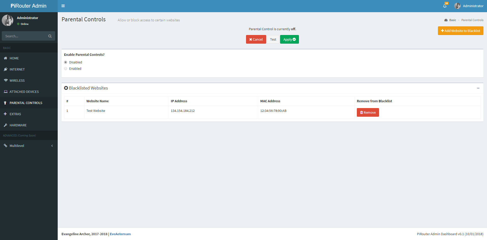

## An Admin Dashboard to manage your Raspberry Pi as a Router!
Better and more detailed ReadMe coming soon! (I promise)

In the meanwhile...

### Homepage

### Internet Configuration

### Wireless Configuration

### Attached Devices

### Parental Controls / Website Blacklist

### Extras

### Hardware

## Changelog

### v0.1 - 1/10/2018
Added all the pages without functionality using AdminLTE

## Features to come
